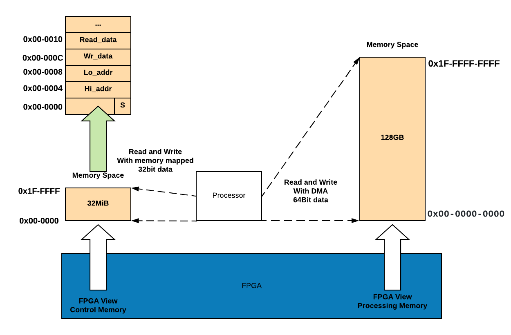

# AWS FPGA PCIe Memory Map

FPGAs are PCIe-attached to an AWS EC2 instance, where each FPGA Slot presents a single FPGA with two PCIe Physical Functions (PFs), each with multiple PCIe Base Address Registers (BARs) as defined in the [AWS Shell Specification](./AWS_Shell_Interface_Specification.md).

This document describes the actual size and attributes of each of the BARs, with some examples on how can they be mapped in a real life application.

Even though all of these PCIe BARs are mapped to the EC2 Instance memory-mapped I/O (MMIO) space, they need to be mapped to the  Linux kernel or a userspace application before accessing them. Please refer to the [Software Programmer's View](./Programmer_View.md) on how the various software pieces can interact with the FPGA PCIe Memory.





# AWS FPGA: Programmer's View of the Custom Logic

This document describes how an application running in Linux userspace would interface with the FPGA Custom Logic (CL) during runtime.

There are two parts required to work with AWS FPGA: Management and Runtime, and the next figure provides a high-level view of these components and how they relate to the underlying FPGA hardware.


1. **Management Interface**: is required for loading/clearing an AFI, checking the status of an AFI, debug of the AFI, Emulated LEDs and Emulated DIP Switches. The management interface is provided in one of three way, one or more can be used concurrently:

  **\[A\]** As linux shell commands called [FPGA Management Tools](../../sdk/userspace/fpga_mgmt_tools/README.md).
  
  **\[B\]** As a C-library called [FPGA Management Lib](../../sdk/userspace/fpga_libs/fpga_mgmt/) to be compiled with the developer's C/C++ application.
  
  **\[C\]** Pre-integrated with [OpenCL runtime library](../../SDAccel)
  
2. **Runtime code**: is required for reading/writing from/to the Custom Logic, handling interrupts, and using the DMA. This is provided by:
  
  **\[D\]** [FPGA PCIe Lib](../../sdk/userspace/fpga_libs/fpga_pci/) is a C-library used to access the FPGA memory space behind the AppPF PCIe BARs, from Linux application space like reading/writing to register space or passing messages. This library can be compiled and linked with the developer's C/C++ application.
  
  **\[E\]** A [DMA Interface](../../sdk/linux_kernel_drivers/xdma/README.md) using standard POSIX API like open()/read()/write() to be used in any C/C++ application for data transfer using DMA. This DMA interface requires installing the [XDMA kernel driver](../../sdk/linux_kernel_drivers/xdma/xdma_install.md) - marked as item **\[G\]**.
  
  **\[F\]** A [Userspace Interrupt/Event notification](../../sdk/linux_kernel_drivers/xdma/user_defined_interrupts_README.md) using standard POSIX API like open() and poll(), to be used in any C/C++ application. This Interrupt/Event interface requires installing the [XDMA kernel driver](../../sdk/linux_kernel_drivers/xdma/xdma_install.md) - marked as item **\[G\]**.
  
  **\[I\]** An [openCL ICD](https://wikipedia.org/wiki/OpenCL#Implementations) library that links with openCL runtime application, like the one generated by Xilinx' SDAccel. 
  


## DMA Example


```C
int dma_example(int slot_id, size_t buffer_size) {
    int write_fd, read_fd, dimm, rc;

    write_fd = -1;
    read_fd = -1;

    uint8_t *write_buffer = malloc(buffer_size);
    uint8_t *read_buffer = malloc(buffer_size);
    if (write_buffer == NULL || read_buffer == NULL) {
        rc = -ENOMEM;
        goto out;
    }

    read_fd = fpga_dma_open_queue(FPGA_DMA_XDMA, slot_id,
        /*channel*/ 0, /*is_read*/ true);
    fail_on((rc = (read_fd < 0) ? -1 : 0), out, "unable to open read dma queue");

    write_fd = fpga_dma_open_queue(FPGA_DMA_XDMA, slot_id,
        /*channel*/ 0, /*is_read*/ false);
    fail_on((rc = (write_fd < 0) ? -1 : 0), out, "unable to open write dma queue");

    rc = fill_buffer_urandom(write_buffer, buffer_size);
    fail_on(rc, out, "unabled to initialize buffer");

    for (dimm = 0; dimm < 4; dimm++) {
        rc = fpga_dma_burst_write(write_fd, write_buffer, buffer_size,
            dimm * MEM_16G);
        fail_on(rc, out, "DMA write failed on DIMM: %d", dimm);
    }

    bool passed = true;
    for (dimm = 0; dimm < 4; dimm++) {
        rc = fpga_dma_burst_read(read_fd, read_buffer, buffer_size,
            dimm * MEM_16G);
        fail_on(rc, out, "DMA read failed on DIMM: %d", dimm);

        uint64_t differ = buffer_compare(read_buffer, write_buffer, buffer_size);
        if (differ != 0) {
            log_error("DIMM %d failed with %lu bytes which differ", dimm, differ);
            passed = false;
        } else {
            log_info("DIMM %d passed!", dimm);
        }
    }
    rc = (passed) ? 0 : 1;

out:
    if (write_buffer != NULL) {
        free(write_buffer);
    }
    if (read_buffer != NULL) {
        free(read_buffer);
    }
    if (write_fd >= 0) {
        close(write_fd);
    }
    if (read_fd >= 0) {
        close(read_fd);
    }
    /* if there is an error code, exit with status 1 */
    return (rc != 0 ? 1 : 0);
}
```

## Memory map per Slot
```
--- FPGA Slot X  
  |----- AppPF  
  |   |------- BAR0  
  |   |         * 32-bit BAR, non-prefetchable
  |   |         * 32MiB (0 to 0x1FF-FFFF)
  |   |         * Maps to OCL AXI-L of the CL
  |   |         * Typically used for CL application registers or OpenCL kernels  
  |   |------- BAR1
  |   |         * 32-bit BAR, non-prefetchable
  |   |         * 2MiB (0 to 0x1F-FFFF)
  |   |         * Maps to BAR1 AXI-L of the CL
  |   |         * Typically used for CL application registers 
  |   |------- BAR2
  |   |         * 64-bit BAR, prefetchable
  |   |         * 64KiB (0 to 0xFFFF)
  |   |         * NOT exposed to CL, used by internal DMA inside the Shell
  |   |------- BAR4
  |             * 64-bit BAR, prefetchable
  |             * 128GiB (0 to 0x1F-FFFF-FFFF)
  |             * First 127GiB are exposed to CL, via pcis_dma AXI bus
  |             * The upper 1GiB is reserved for future use
  |
  |
  |----- MgmtPF  
     |------- BAR0  
     |         * 64-bit BAR, prefetchable
     |         * 16KiB (0 to 0x3FFF)
     |         * Maps to internal functions used by the FPGA management tools
     |         * Not mapped to CL
     |------- BAR2
     |         * 64-bit BAR, prefetchable
     |         * 16KiB (0 to 0x3FFF)
     |         * Maps to internal functions used by the FPGA management tools
     |         * Not mapped to CL
     |------- BAR4
               * 64-bit BAR, prefetchable
               * 4MiB (0 to 0x3FFFFF)
               * Maps to CL through SDA AXI-L
               * Could be used by Developer applications, or if using the AWS Runtime Environment (like SDAccel case), it will be used for performance monitoring.
```
